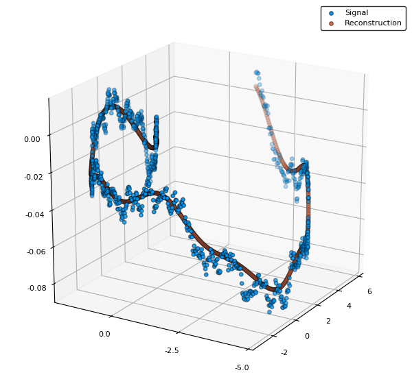

# BasisFunctionExpansions

[](https://travis-ci.org/baggepinnen/BasisFunctionExpansions.jl)

A Julia toolbox for approximation of functions using basis function expansions.
Currently supported basis functions are
- Uniform Radial Basis Functions (Gaussian with diagonal covariance matrix)


# Usage
Plotting functionality requires `Plots.jl`
## Single dim
```julia
N    = 1000
v    = linspace(0,10,N) # Scheduling signal
y    = randn(N)         # Signal to be approximated
y    = filt(ones(500)/500,[1],y)
Nv   = 10               # Number of basis functions
rbf  = UniformRBFE(v,Nv, normalize=true) # Approximate using radial basis functions with constant width
bfa  = BasisFunctionApproximation(y,v,rbf,1) # Create approximation object
yhat = bfa(v) # Reconstruct signal using approximation object
scatter(v,y, lab="Signal")
scatter!(v,yhat, lab="Reconstruction")
```


## Multidim
```julia
N    = 1000
x    = linspace(0,2pi-0.2,N)
v    = [cos(x) sin(x)].*x # Scheduling signal
y    = randn(N)         # Signal to be approximated
y    = filt(ones(500)/500,[1],y)
Nv   = [10,10]          # Number of basis functions along each dimension
rbf  = MultiUniformRBFE(v,Nv, normalize=true) # Approximate using radial basis functions with constant width (Not isotropic, but all functions have the same diagonal covariance matrix)
bfa  = BasisFunctionApproximation(y,v,rbf,0.0001) # Create approximation object
yhat = bfa(v) # Reconstruct signal using approximation object
scatter3d(v[:,1],v[:,2],y, lab="Signal")
scatter3d!(v[:,1],v[:,2],yhat, lab="Reconstruction")
```

